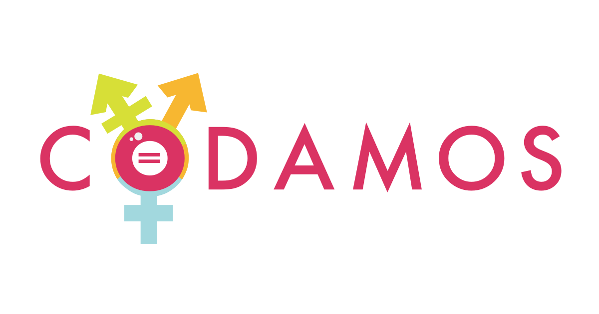

# Codamos



> Descrição curta.

Descrição longa do projeto.

## Table of Contents

- [Instalação](#instalacao)
- [Uso](#uso)
- [Código de Conduta](#codigo-de-conduta)
- [Contribuindo](#contribuindo)
- [Licença](#licenca)

## Instalação

```
```

### Any optional sections

## Uso

```
```

## Código de Conduta

Toda interação deve estar de acordo com o nosso [Código de Conduta](PDF-Código de Conduta.pdf)

## Contribuindo

Veja o [guia de contribuição](contribuindo.md)!


## Licença

[<<tipo da licença>> © Codamos.](LICENSE)
