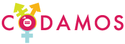

Este é o código-fonte do projeto [Codamos](https://codamos.club).

O Codamos é como uma vitrine de [eventos][events-page], meetups, cursos,
workshops, palestras e [palestrantes][speakers-page]. Aqui encontrará eventos inclusivos.

Nosso propósito é descomplicar a comunicação entre quem organiza e quem quer
participar de eventos. As pessoas são nossa essência, estão em primeiro lugar e fazemos o nosso
melhor para reconhecer, valorizar e respeitar a pluralidade.

Para conhecer mais sobre o Codamos, acesse a página [https://codamos.club/quem-somos](https://codamos.club/quem-somos).

## Adicionando um novo evento

Se você conhece um evento inclusivo que não foi listado na [página de eventos][events-page],
pode criá-lo de duas formas no Codamos:

1. Através [do formulário][new-event-form], que é indicado para quem não conhece
muito de código, ou não tem muito tempo para abrir um _Pull request_;
2. Através de um _pull request_, que é bem útil quando se precisa incluir imagens.

### Adicionando evento através de pull request

Primeiro, é preciso criar um novo [_fork_ do projeto](https://github.com/codamos/codamos.github.io/fork) através da interface do Github.

Feito isso, você deverá criar um arquivo de evento dentro do diretório `_events/`. Esse arquivo
deve ter o nome no formato `yyyy-mm-dd-titulo-do-evento.yml`, onde `yyyy` é o ano do evento, `mm`
o mês do evento e `dd` o dia de início do evento. Um exemplo de nome: `2018-12-20-rubyconf-br.yml`.

Um arquivo de evento contém a descrição do evento, com alguns campos obrigatórios.
O arquivo possui o seguinte formato:

```yaml
---
title: "Título do evento" (obrigatório)
inclusive: true # (se é inclusivo ou não)
partners: true # (se o evento é de parceiros do Codamos)
cfp: true # (se o evento está aceitando propostas de palestras - call for papers)
location: "Cidade - UF"
date: "20/12" # (data do evento)
from: "2018-12-20" # (data do começo do evento)
until: "2018-12-20" # (data do final do evento)
banner: banner.png # (um nome de imagem presente em `images/eventos/`)
group: locaweb.png # (um nome de grupo presente em `images/grupo/`)
group_name: "Nome do grupo"
tags:
- algumas
- tags
hashtag: hash-tag-do-event-no-twitter
twitter: conta-no-twitter
facebook: conta-no-facebook
main_url: https://link-do-evento.com.br
rsvp_url: https://link-para-submeter-palestras.com.br
```

Há vários outros campos que são descritos no cabeçalho do [arquivo de eventos](_includes/event.html).
É possível encontrar bons exemplos de eventos no diretório `_events`.

## Adicionando uma nova pessoa que deseja ser palestrante, mentor(a) ou voluntário(a)

Se você palestra ou quer começar a palestrar e gostaria de aparecer na lista de pessoas
palestrantes, mentoras ou voluntárias da comunidade, basta abrir um _pull request_ com
suas informações adicionadas no [arquivo `_data/speakers.yml`](_data/speakers.yml).
Este arquivo contém uma descrição de todos os campos possíveis em seu cabeçalho.

Se prefirir, [é possível editar o arquivo][editing-files] diretamente através do ícone
de edição do Github.

## Adicionando grupos e comunidades

Se conhece um grupo inclusivo e gostaria de adicionar ao Codamos, basta editar
[o arquivo `_data/communities.yml`](_data/communities.yml). Este arquivo também possui uma descrição
de seus campos no cabeçalho.

## Adicionando podcasts

É possível adicionar podcasts editando [o arquivo `_data/podcasts.yml`](_data/podcasts.yml).
Este arquivo também possui uma descrição dos campos no cabeçalho.

## Desenvolvimento

Se você quer trabalhar com o projeto em seu computador, aqui estão algumas coisas que você
vai precisar:

1. Instalar a última versão do Ruby.
[O site do Ruby descreve várias formas de fazer a instalação][ruby-install].
A mais recomendada é a através do `rbenv`. Porém escolha a que mais se adapte ao seu sistema;
2. Fazer um _fork_ e clonar o projeto;
3. Executar o comando `bundle install` para instalar as dependências;
4. Executar o comando `bundle exec jekyll serve` para subir o site em ambiente local. Ele ficará
disponível no endereço `http://127.0.0.1:4000`.

A partir do quarto ponto, qualquer alteração que fizer será refletida após o recarregamento da página
na janela do navegador.

## Código de conduta

A fim de evitar qualquer mal-entendido, adotamos um [Código de Conduta][code-of-conduct].
Solicitamos que todos os participantes, palestrantes, grupos, eventos, patrocinadores, apoiadores e
voluntários concordem em aderir a essas diretrizes.

Contamos com a cooperação de todos para ajudar a garantir uma experiência segura,
agradável e positiva para todos.

[new-event-form]: https://forms.gle/Xogq3ocRbWKgtdN49
[events-page]: https://codamos.club/eventos
[speakers-page]: https://codamos.club/palestrantes
[editing-files]: https://help.github.com/articles/editing-files-in-your-repository/
[ruby-install]: https://www.ruby-lang.org/en/documentation/installation/
[code-of-conduct]: https://www.codamos.club/codigo-de-conduta
